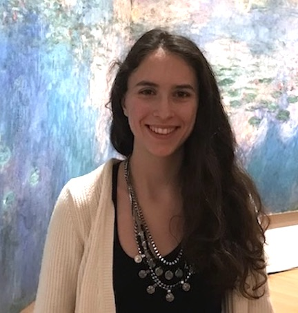

## Welcome to my website!

  My name is Carmen Amo Alonso and I am a graduate student in Control and Dynamical Systems at the Department of Computing and Mathematical Sciences at Caltech, where I work under the advice of <a href="http://www.cds.caltech.edu/~doyle/wiki/index.php?title=Main_Page">Prof. John Doyle</a>.

  
Broadly, my research focuses on robust and distributed optimal control for large-scale networks, as well as in and the applications to computational linguistics and biology. I am working with <a href="https://nikolaimatni.github.io/index.html">Prof. Nikolai Matni</a>  (UPenn) and <a href="http://www.columbia.edu/~ja3451/">Prof. James Anderson</a> (Columbia Unversity) on Distributed and Localized Model Predictive Control via System Level Synthesis, and I collaborate with <a href="https://shih-hao-tseng.github.io/website/index.html">Dr. Shih-Hao Tseng</a>  on a parallel implementation of these algorithms in the GPU. I also work with <a href="https://pachterlab.github.io">Prof. Lior Patcher</a> on developing computational tools to answer fundamental questions in linguistics.

Prior to starting my Ph.D, I recieved a B.Sc. in Aerospace Engineering from the Technical Univeristy of Madrid in 2016 and a M.Sc. in Space Engineering from Caltech in 2017.  

